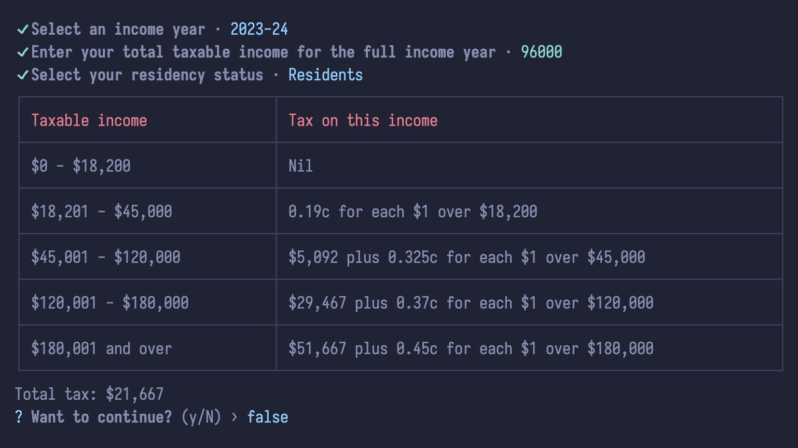

# 🧰 simple tax calculator

> A simpler, command-line version of the official Australian Tax calculator website found at: [ato.gov.au](https://www.ato.gov.au/Calculators-and-tools/Host/?anchor=STC&anchor=STC#STC/questions).

## Inputs

```bash
Select an income year: 2021-22
Enter your total taxable income for the full income year: 98000
Select your residency status: Resident

Total tax: $22,317
```



## Scripts

### `npm run start:dev`

Starts the application in development using `nodemon` and `ts-node` to do hot reloading.

### `npm run start`

Starts the app in production by first building the project with `npm run build`, and then executing the compiled JavaScript at `build/index.js`.

### `npm run build`

Builds the app at `build`, cleaning the folder first.

### `npm run test`

Runs the `jest` tests once.

### `npm run test:dev`

Run the `jest` tests in watch mode, waiting for file changes.

### `npm run prettier-format`

Format your code.

### `npm run prettier-watch`

Format your code in watch mode, waiting for file changes.
